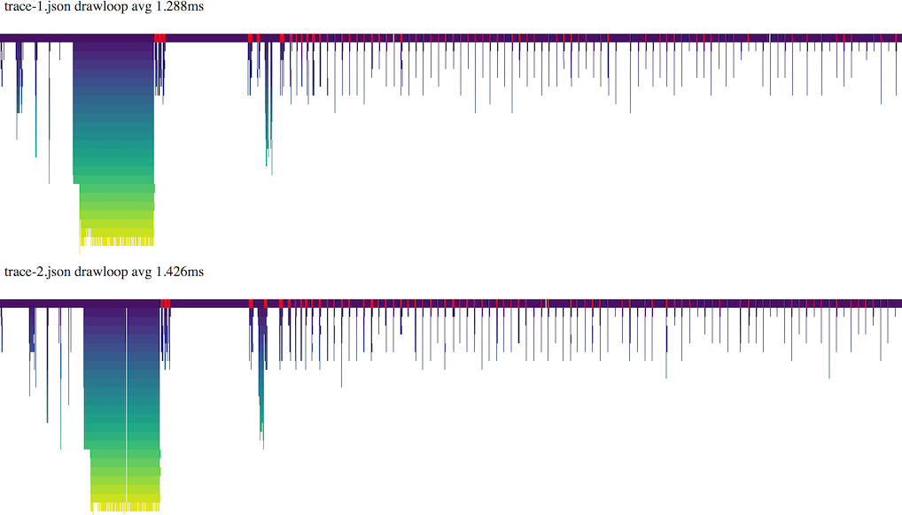

# autoperf

Automatic website profiling using headless Chrome

## Usage

```
npm i -g autoperf
autoperf url -t timeout_seconds -o output.json
```


## Example

```sh
autoperf http://marcinignac.com/experiments/continuous-transition/demo/ -o trace-1.json
autoperf http://marcinignac.com/experiments/continuous-transition/demo/ -o trace-2.json
autoperf compare drawloop trace-1.json trace-2.json
open compare.html
```


